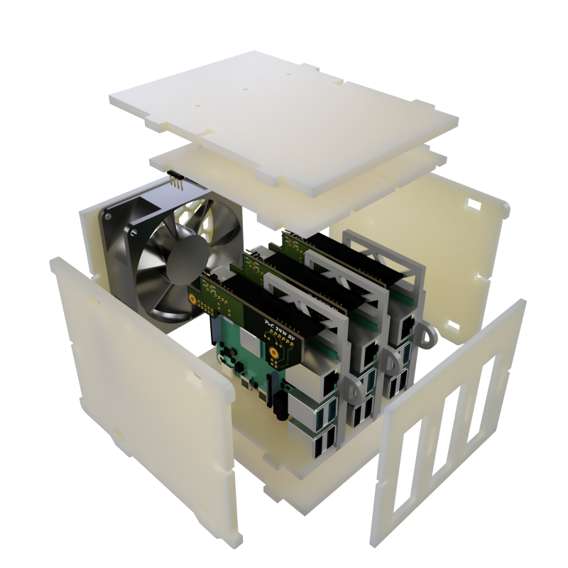
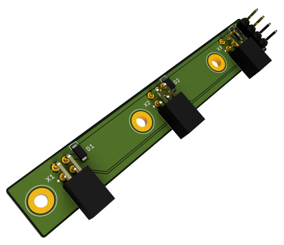
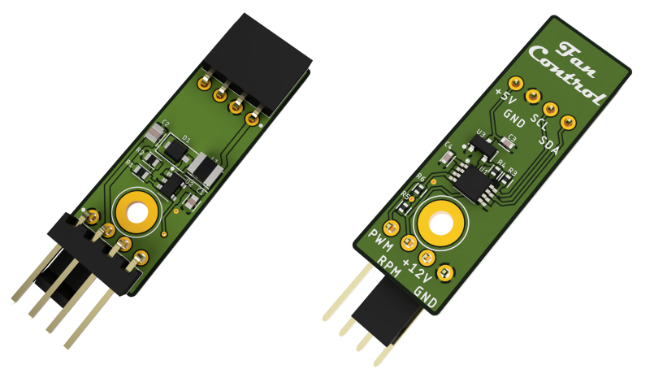
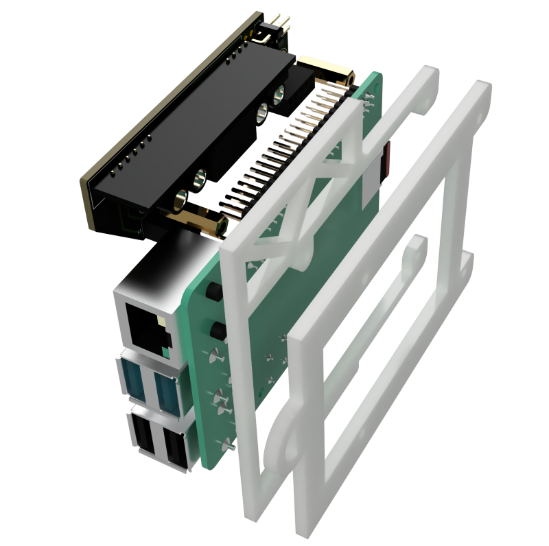
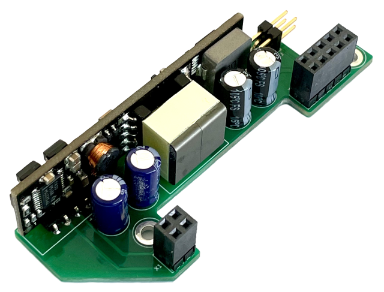

# A quiet case for three Raspberry Pis

* ✨Power over Ethernet
* ✨Hot-swap support 
* ✨PWM fans support
---

## Table of Contents

- [Enclosure](#enclosure)
  - [Power and I2C rail](#power-and-i2c-rail)
  - [Fan controller](#fan-controller)
  - [Bill of materials](#enclosure-bill-of-materials)
- [Frames](#frames)
  - [PoE assembly](#poe-assembly)
  - [Bill of materials](#frames-bill-of-materials)
- [Other hardware needed](#other-hardware-needed)
- [License](#license)

## Enclosure

The case box is built from the following parts ([drawings](drawings/cluster-box-drawings.pdf)):

* Left, right, top, and bottom panels.
* Top and bottom panels with grooves for the Raspberry Pi frames.
* A back panel with a fan grill for 80mm x 80mm fan.
* A front panel with openings for USB and Ethernet ports. 

> Watch this [video](https://youtu.be/zfYN2NjLpm8) to see how to assembly the case.

### Power and I2C rail

The power and I2C rail connects all Raspberry Pis to the I2C bus and provides power to the fan controller and a chassis fan. Low forward drop Schottky diodes combined in an OR-ing circuit provide power to the load when at least one Raspberry Pi is installed without the risk of reverse current flow. 

> * [Schematics and PCB (EagleCAD)](power-rail)
> * [BOM](power-rail/power-rail-bom.csv)

### Fan controller

The fan controller converts 5V to 12V and uses [EMC2101-R IC](https://www.microchip.com/wwwproducts/en/EMC2101) from Microchip/SMSC to control a 4-pin PWM fan and monitor its speed via the I2C bus. This controller is installed on the left panel of the enclosure and connected to the [Power and I2C rail](#power-and-i2c-rail).

> * [Schematics and PCB (EagleCAD)](fan-controller)
> * [BOM](fan-controller/fan-controller-bom.csv)

### Bill of materials

|        Part         | Quantity | Link |
|---------------------|----------|------|
| M2.5 x 14mm screw   | 3        | [M2.5 machine screws nuts kit](https://www.ebay.com/itm/182282169506)     |
| M2.5 x 10mm screw   | 1        | [M2.5 machine screws nuts kit](https://www.ebay.com/itm/182282169506)     |
| M2.5 nut            | 4        | [M2.5 machine screws nuts kit](https://www.ebay.com/itm/182282169506)     |
| M2.5 x 2mm spacer   | 4        | [M2.5 round plastic spacer](https://www.digikey.com/en/products/detail/w%C3%BCrth-elektronik/960020021/9488359)     |
| M3 x 12mm screw     | 8        | 	[M3x12mm machine screws](https://www.amazon.com/Uxcell-a15070200ux0058-Stainless-Phillips-Screws/dp/B012TE1TBS) |
| M3 nut              | 8        | [M3 hexagon nuts](https://www.amazon.com/uxcell-Metric-Stainless-Hexagon-Silver/dp/B07H3T4859) |
| M3 nylon washer     | 8        | [M3 nylon flat washers](https://www.amazon.com/uxcell-Insulation-Spacer-Washer-Gasket/dp/B016EPLM5G) |
| M4 x 14mm screw     | 4        | [M4x14mm machine screws](https://www.amazon.com/uxcell-M4x14mm-Phillips-Stainless-Fasteners/dp/B07MF44LGC) |
| M4 nut              | 4        | [M4 hexagon nuts](https://www.amazon.com/uxcell-Metric-Stainless-Hexagon-Silver/dp/B07H3VF3BF) |
| 80mm x 80mm x 25mm fan | 1        | [Noctua NF-A8 PWM](https://noctua.at/en/nf-a8-pwm) |
| Power and I2C rail | 1        | [Schematics and PCB (EagleCAD)](power-rail), [BOM](power-rail/power-rail-bom.csv) |
| Fan controller | 1        | [Schematics and PCB (EagleCAD)](fan-controller), [BOM](fan-controller/fan-controller-bom.csv) |
| Case panels | 8        | [Drawings](drawings/cluster-box-drawings.pdf), [Templates for laser cutting](drawings/cluster-box-laser-cut.pdf) |

## Frames

Raspberry Pis need to be mounted on frames so that they can be pushed into the case and retracted individually ([drawings](drawings/frame-drawings.pdf)).

### PoE assembly

The solution relies on a custom PoE HAT with [RT5400-5V 30W module](https://www.aliexpress.com/item/33038562052.html). For this HAT to work, the switch your cluster is connected to needs to support IEEE 802.3af Power over Ethernet protocol (e.g. [TL-SG1005P switch](https://www.tp-link.com/us/business-networking/poe-switch/tl-sg1005p/)). 

> * [Schematics and PCB (EagleCAD)](poe-assembly)
> * [BOM](poe-assembly/poe-assembly-bom.csv)

### Bill of materials
|        Part         | Quantity | Link |
|---------------------|----------|------|
| M2.5 x 10mm screw   | 12       | [M2.5 machine screws nuts kit](https://www.ebay.com/itm/182282169506)     |
| M2.5 x 5mm screw    | 6        | [M2.5 machine screws nuts kit](https://www.ebay.com/itm/182282169506)     |
| M2.5 nut            | 6        | [M2.5 machine screws nuts kit](https://www.ebay.com/itm/182282169506)     |
| M2.5 x 14mm F/F hex brass standoff | 6 | [Hex standoff M2.5 x 14mm brass](https://www.digikey.com/en/products/detail/harwin-inc/R25-1001402/3924434) |
| Raspberry Pi 4 Model B 4-8Gb | 3 | [Raspberry Pi 4](https://www.amazon.com/Uxcell-a15070200ux0058-Stainless-Phillips-Screws/dp/B012TE1TBS) | 
| Micro SD 32 Gb | 3 | [SanDisk Ultra 32GB](https://www.amazon.com/SanDisk-Ultra-UHS-I-Memory-Adapter/dp/B00M55C0NS) |
| PoE assembly | 3 | [Schematics and PCB (EagleCAD)](poe-assembly), [BOM](poe-assembly/poe-assembly-bom.csv) |
| Frame panels | 2 x 3 | [Drawings](drawings/frame-drawings.pdf), [Templates for laser cutting](drawings/frame-laser-cut.pdf) |

## Other hardware needed

* Three Ethernet patch cables 230-250mm length.
* A switch with 802.3af Power over Ethernet support (e.g. [TL-SG1005P switch](https://www.tp-link.com/us/business-networking/poe-switch/tl-sg1005p/)).

## License
This work is licensed under a Creative Commons Attribution-ShareAlike 4.0 International License, check [LICENSE](LICENSE) for more information.

You can support my work in the field of open-source hardware by clicking .

